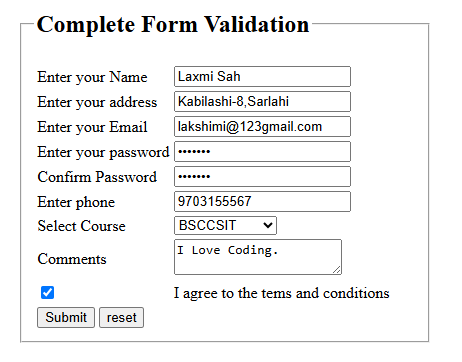

# Complete Form Validation

## Project Overview

This project is a simple "Complete Form Validation" system built using "HTML, CSS, and JavaScript". It validates user input on the client side before allowing the form to be submitted. The project demonstrates how JavaScript can be used to improve user experience by preventing invalid data entry.


##  Features

* ✅ Name validation
* ✅ Address validation
* ✅ Custom email validation
* ✅ Password validation (minimum 8 characters)
* ✅ Confirm password matching
* ✅ Phone number validation
* ✅ Course selection validation
* ✅ Comments validation
* ✅ Terms and Conditions checkbox validation
* ✅ Displays clear error messages
* ✅ Automatically clears previous error messages before each validation

## Screenshot


## Technologies Used

* HTML5
* CSS3
* JavaScript 


## Project Structure

```
Complete-Form-Validation/
│
├── form-validation.html
└── README.md
```

## How to Run

1. Download or clone the repository.
2. Open the project folder.
3. Double-click **form-validation.html** or open it in any modern web browser.
4. Fill in the form and test the validation.


##  Validation Rules

* Name cannot be empty.
* Address cannot be empty.
* Email must be in a valid format.
* Password must contain at least 8 characters.
* Confirm password must match the password.
* Phone number must contain only numeric values.
* A course must be selected.
* Comments cannot be left blank.
* Users must agree to the Terms and Conditions.


## Learning Objectives

This project helped practice:

* DOM Manipulation
* Event Handling
* Form Validation
* JavaScript Functions
* Conditional Statements
* Client-side Input Validation


## Future Improvements

* Add stronger password validation.
* Validate phone numbers with regular expressions.
* Show success messages after valid submission.
* Store submitted data using Local Storage or a backend.
* Make the design responsive for mobile devices.


##  Author

**Laxmi  Sah**

If you found this project helpful, feel free to  the repository.
